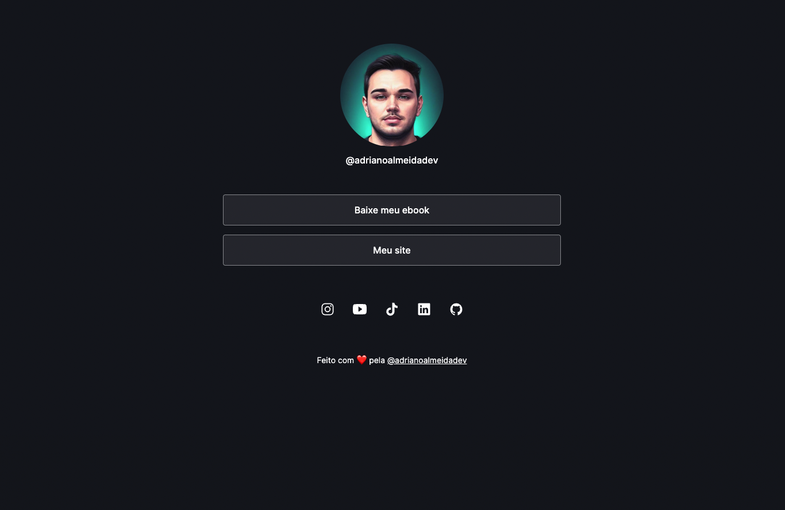

<h1 align="center"> Adriano Almeida Links </h1>

  Página de links para o projeto <a href="https://adrianoalmeida.dev">adrianoalmeida.dev</a> @adrianoalmeidadev

  <a href="#-tecnologias">Tecnologias</a>&nbsp;&nbsp;&nbsp;|&nbsp;&nbsp;&nbsp;
  <a href="#-projeto">Projeto</a>&nbsp;&nbsp;&nbsp;|&nbsp;&nbsp;&nbsp;
  <a href="#memo-licença">Licença</a>

  

 

  

## 🚀 Tecnologias

Esse projeto foi desenvolvido com as seguintes tecnologias:

- HTML e CSS
- JavaScript
- Git e Github

## 💻 Projeto

Adriano Almeida Dev é um projeto destinado focado em produção de conteúdo sobre programação. Esse projeto tem como objetivo anexar os links úteis do projeto.

## :memo: Licença

Esse projeto está sob a licença MIT.

---

Feito com ♥ by adrianoalmeida.dev :wave:
